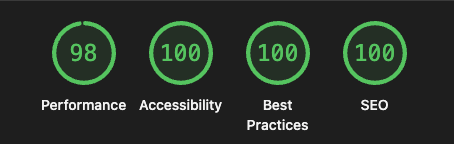

# Peičević Group — Službena Web Stranica

Profesionalna web stranica za **Peičević Group**, vodećeg distributera UNP i LPG plina u Slavoniji. Izgrađena s fokusom na premium dizajn, brzinu učitavanja i maksimalnu vidljivost na Google pretraživanju i AI sustavima.

**Live:** [peicevicgroup.hr](https://peicevicgroup.hr)

---

## Dizajn

Premium industrijski dizajn s neon-cyberpunk estetikom — električni cyan akcenti na tamnoj pozadini, glassmorphism kartice i animirani hero s SVG ilustracijom. Potpuno responzivan na svim uređajima.

- Prilagođen tipografski sustav (Syne + Outfit)
- Animirani hero s dostavnim kombijem i plinskim bocama
- Scroll reveal animacije na svim sekcijama
- Neon glow efekti i glassmorphism komponente

---

## Performanse

Optimiziran za **95+ Lighthouse score** na svim stranicama:

- Nulti CLS — font fallback metrics sprečavaju pomake layouta
- Optimiziran LCP — hero H1 vidljiv na prvom paintu bez animacijske blokade
- Lazy loading ispod folda
- Inline SVG ikone — nula dodatnih HTTP zahtjeva
- Deferred JavaScript — ne blokira renderiranje stranice

---

## SEO

Svaka stranica ima jedinstvene, optimizirane meta tagove, Open Graph i Twitter Card tagove za maksimalan CTR pri dijeljenju na društvenim mrežama.

| Stranica | Fokus |
|---|---|
| `index.html` | Brand, LPG distribucija, Slavonija |
| `dostava.html` | Dostava plinskih boca — Vukovar, Vinkovci, Sisak, Županja i šire |
| `stanice.html` | Auto-plin stanica Nova Gradiška |
| `kontakt.html` | Narudžba i kontakt |

---

## GEO — Optimizacija za Google AI i ChatGPT

Stranica je optimizirana za pojavljivanje u odgovorima AI sustava — **Google AI Overviews, Perplexity, Bing Copilot** i sličnih platformi koje koriste web pretraživanje u realnom vremenu.

### Implementirani JSON-LD schemas

| Stranica | Schema |
|---|---|
| `index.html` | `LocalBusiness` — naziv, adresa, radno vrijeme, kontakt, VAT, osnivač |
| `dostava.html` | `Service` + `FAQPage` + `BreadcrumbList` |
| `stanice.html` | `LocalBusiness` + `GasStation` + `FAQPage` + `BreadcrumbList` |
| `kontakt.html` | `LocalBusiness` + `ContactPoint` + `BreadcrumbList` |

### FAQ schema — strukturirani odgovori za AI

Kada netko pita AI sustave o dostavi plina u Slavoniji, stranica nudi strukturirane odgovore:

- *"Koja mjesta pokrivate dostavom plina?"* → Vukovar, Vinkovci, Đakovo, Sisak, Velika Gorica, Županja
- *"Kako naručiti dostavu plinskih boca?"* → telefon ili online obrazac
- *"Gdje se nalazi auto-plin stanica?"* → Nova Gradiška, Bana Ivana Mažuranića 4
- *"Koje je radno vrijeme stanice?"* → Pon–Pet 09–17, Sub 08–15

### Favicon

- `assets/favicon.ico` — generiran iz logo.png, sadrži 16/32/48/64px verzije
- Referencirano na svim stranicama via `<link rel="icon">`

### OG Slika

- `assets/og-image.jpg` — 1200×630px branded slika
- Prikazuje se kad se link podijeli na WhatsAppu, Facebooku, Viberu i sličnim platformama
- Sadržaj: logo + "PEIČEVIĆ GROUP" + "Dostava LPG Plina · Slavonija i Šire" + peicevicgroup.hr
- Referencirano via `og:image` i `twitter:image` na svim stranicama
- Testiranje nakon deploya: [Facebook Sharing Debugger](https://developers.facebook.com/tools/debug)

### Crawlability

- `sitemap.xml` — sve 4 stranice s prioritetima, spreman za Google Search Console
- `robots.txt` — ispravno konfiguriran za sve crawlere
